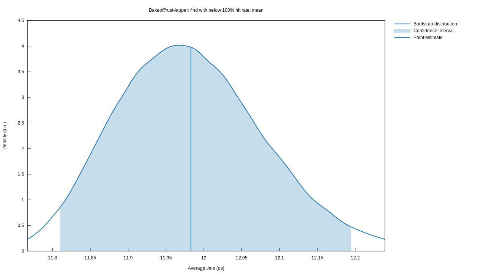
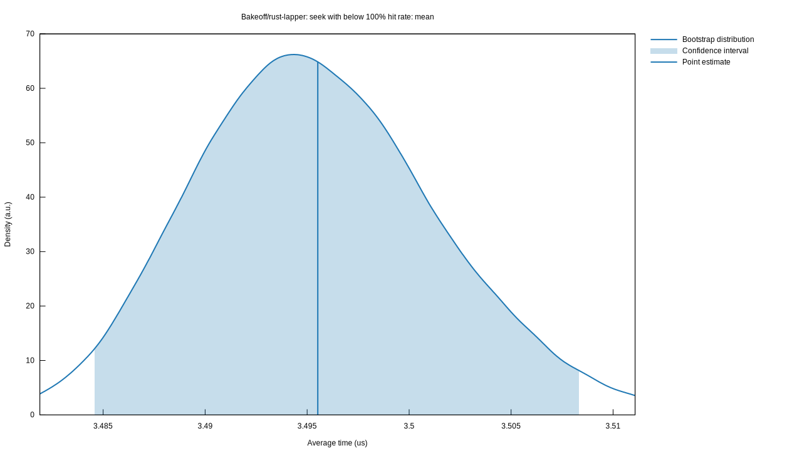
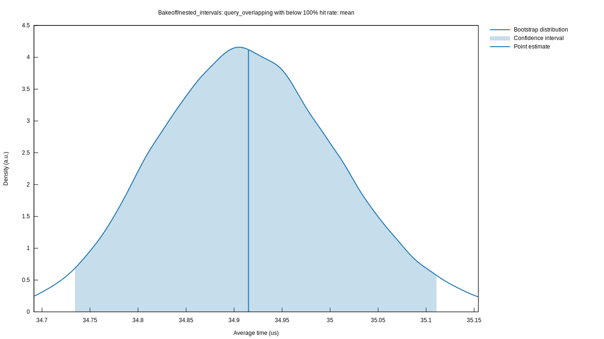

# rust-lapper

[Documentation](https://docs.rs/rust-lapper)

[Crates.io](https://crates.io/crates/rust-lapper)

This is a rust port of Brent Pendersen's
[nim-lapper](https://github.com/brentp/nim-lapper). It has a few notable
differences, mostly that the find and seek methods both return
iterators, so all adaptor methods may be used normally.

This crate works well for interval data that does not include very long
intervals that engulf a majority of other intervals. In comparisons against
other intervals trees, it is twice as slow in the worst case scenario of an
interval spanning the whole set of possible positions.

However, on more typical datasets, this crate is between 4-10x faster
than other interval overlap methods.

## Benchmarks

Benchmarks performed on a sub 100% hit rate dataset:





Benchmarks with a whole set spanning interval:


## Example

```rust
use rust_lapper::{Interval, Lapper};

type Iv = Interval<u32>;
fn main() {
    // create some fake data
    let data: Vec<Iv> = vec![
        Iv{start: 70, stop: 120, val: 0}, // max_len = 50
        Iv{start: 10, stop: 15, val: 0},
        Iv{start: 10, stop: 15, val: 0}, // exact overlap
        Iv{start: 12, stop: 15, val: 0}, // inner overlap
        Iv{start: 14, stop: 16, val: 0}, // overlap end
        Iv{start: 40, stop: 45, val: 0},
        Iv{start: 50, stop: 55, val: 0},
        Iv{start: 60, stop: 65, val: 0},
        Iv{start: 68, stop: 71, val: 0}, // overlap start
        Iv{start: 70, stop: 75, val: 0},
    ];

    // Make lapper structure
    let mut lapper = Lapper::new(data);
    
    // Iterator based find to extract all intervals that overlap 6..7
    // If your queries are coming in start sorted order, use the seek method to retain a cursor for
    // a big speedup.
    assert_eq!(
        lapper.find(11, 15).collect::<Vec<&Iv>>(), vec![
            &Iv{start: 10, stop: 15, val: 0},
            &Iv{start: 10, stop: 15, val: 0}, // exact overlap
            &Iv{start: 12, stop: 15, val: 0}, // inner overlap
            &Iv{start: 14, stop: 16, val: 0}, // overlap end
        ]
    );

    // Merge overlapping regions within the lapper to simlify and speed up queries that only depend
    // on 'any' overlap and not how many
    lapper.merge_overlaps();
    assert_eq!(
        lapper.find(11, 15).collect::<Vec<&Iv>>(), vec![
            &Iv{start: 10, stop: 16, val: 0},
        ]
    );

    // Get the number of positions covered by the lapper tree:
    assert_eq!(lapper.cov(), 73);

    // Get the union and intersect of two different lapper trees
    let data = vec![
        Iv{start: 5, stop: 15, val: 0},
        Iv{start: 48, stop: 80, val: 0},
    ];
    let (union, intersect) = lapper.union_and_intersect(&Lapper::new(data));
    assert_eq!(union, 88);
    assert_eq!(intersect, 27);
}
```
